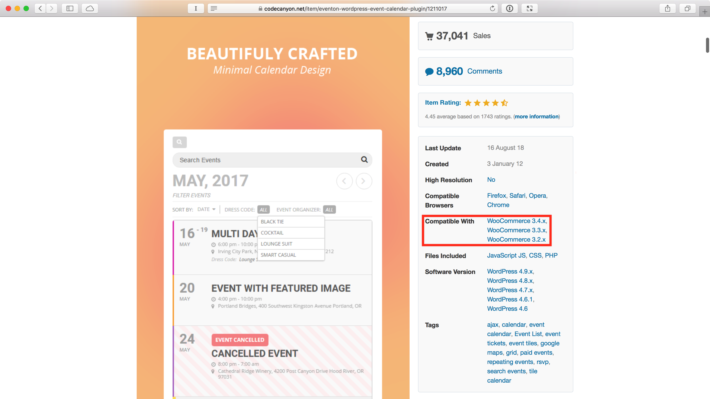

theme: Plain Jane, 1
slidecount: true
slidenumbers: true
build-lists: true
autoscale: true

## [#wpconference](https://twitter.com/hashtag/wpconference)

# Jak na WordPress pluginy

### Petr Hlavička

#### [hlavicka.cz](https://www.hlavicka.cz/)

[.slidecount: false]
[.slidenumbers: false]

---

## Obsah přednášky

- Co je to plugin
- Možnosti instalace pluginů
- Ceny pluginů
- Jak vybrat plugin
- Čeština (překlady)
- Doporučení

[.footer: Petr Hlavička: Jak na WordPress pluginy]

---

# Co je to plugin?

[.footer: Petr Hlavička: Jak na WordPress pluginy - Co je to plugin?]

---

# plugin přidává vlastnost či funkci do WordPressu

[.footer: Petr Hlavička: Jak na WordPress pluginy - Co je to plugin?]

---

# Jak plugin nainstalovat?

- Přímo z administrace
- Pomocí archivu ZIP v administraci
- Pomocí FTP
- Z GitHub

[.footer: Petr Hlavička: Jak na WordPress pluginy - Instalace]

---

[.slidecount: false]
[.slidenumbers: false]

---

[.slidecount: false]
[.slidenumbers: false]

---

## Pomocí FTP

1. Rozbalíte archiv ZIP pluginu do složky (`wordpress-seo.zip` -> `wordpress-seo`).
1. Vložíte složku pomocí FTP klienta do složky `wp-content/plugins/` na webového hostingu.
1. Aktivujete plugin.

[.footer: Petr Hlavička: Jak na WordPress pluginy - Instalace]

---

## Z GitHubu

- Pomocí pluginu [GitHub Updater](https://github.com/afragen/github-updater/) ([návod k instalaci](https://github.com/afragen/github-updater/wiki/Installation#upload)).
- Aktualizace jsou potom stejné, jako u pluginů přímo z WordPress repositáře.
- V ukázce instalace pluginu [CFDB](https://github.com/mdsimpson/contact-form-7-to-database-extension).

[.footer: Petr Hlavička: Jak na WordPress pluginy - Instalace]

---

[.slidecount: false]
[.slidenumbers: false]

---

# Ceny pluginů

[.footer: Petr Hlavička: Jak na WordPress pluginy - Ceny pluginů]

---

## Komplet zdarma

- oficiální [repositář pluginů](https://cs.wordpress.org/plugins/) pro WordPress
- případně "neoficiální" i na [GitHub](https://github.com/topics/wordpress-plugin)
- omezená podpora autora pluginu
- nejistá budoucnost pluginu

[.footer: Petr Hlavička: Jak na WordPress pluginy - Ceny pluginů]

---

## Freemium

- základní funkčnost zdarma
- pokročilejší již placené
- vždy v [repositáři WordPressu](https://cs.wordpress.org/plugins/)

[.footer: Petr Hlavička: Jak na WordPress pluginy - Ceny pluginů]

---

## Placené (jednorázově / předplatné)

- většinou komplexnější funkce
- WordPress nemá vlastní prodejní kanál
- ke koupi na webu autora pluginu
- nebo na prodejních portálech

[.footer: Petr Hlavička: Jak na WordPress pluginy - Ceny pluginů]

---

## Prodejní portály

- [CodeCanyon](https://codecanyon.net/category/wordpress) ([refund policy](https://codecanyon.net/page/customer_refund_policy))
- [Creative Market](https://creativemarket.com/themes/wordpress/plugins) ([refund policy](https://support.creativemarket.com/hc/en-us/articles/236189908-Refund-FAQ-Common-Issues))
- [MOJO Marketplace](https://www.mojomarketplace.com/plugins/wordpress) ([refund policy](https://mojosupport.zendesk.com/hc/en-us/articles/202740095-What-is-the-MOJO-refund-policy-))
- [Codester](https://www.codester.com/categories/32/wordpress-plugins) ([refund policy](https://www.codester.com/forum/topic/76/how-can-you-apply-for-a-refund))
- [PickPlugins](https://www.pickplugins.com/plugins/) ([refund policy](https://www.pickplugins.com/refund-policy/))

[.build-lists: false]

[.footer: Petr Hlavička: Jak na WordPress pluginy - Ceny pluginů]

---

# Jak si vybrat ten pravý plugin?

[.footer: Petr Hlavička: Jak na WordPress pluginy - Jak vybrat plugin]

---

# Než se začne

- Co má konkrétně plugin dělat?
- Opravdu přispěje požadovaná funkčnost návštěvníkům stránek?

[.footer: Petr Hlavička: Jak na WordPress pluginy - Jak vybrat plugin]

---

## Vybíráme

- Projít popis, screenshoty či videa pluginu před samotnou instalací.
- Nezpomaluje mi web? ([jak to zjistit](https://www.wplama.cz/5-nastroju-pro-testovani-vykonu-vasi-stranky/))
- Možnosti vrácení peněz u placeného pluginu.

[.footer: Petr Hlavička: Jak na WordPress pluginy - Jak vybrat plugin]

---

# Vybíráme na oficiálním repositáři pluginů
## https://cs.wordpress.org/plugins/

[.footer: Petr Hlavička: Jak na WordPress pluginy - Jak vybrat plugin]

---

[.footer: Petr Hlavička: Jak na WordPress pluginy - Jak vybrat plugin]

---

[.footer: Petr Hlavička: Jak na WordPress pluginy - Jak vybrat plugin]

---

[.footer: Petr Hlavička: Jak na WordPress pluginy - Jak vybrat plugin]

---

[.footer: Petr Hlavička: Jak na WordPress pluginy - Jak vybrat plugin]

---

[.footer: Petr Hlavička: Jak na WordPress pluginy - Jak vybrat plugin]

---

[.footer: Petr Hlavička: Jak na WordPress pluginy - Jak vybrat plugin]

---

[.footer: Petr Hlavička: Jak na WordPress pluginy - Jak vybrat plugin]

---

[.footer: Petr Hlavička: Jak na WordPress pluginy - Jak vybrat plugin]

---

# Vybíráme na CodeCanyon
## https://codecanyon.net/category/wordpress

[.footer: Petr Hlavička: Jak na WordPress pluginy - Jak vybrat plugin]

---

[.footer: Petr Hlavička: Jak na WordPress pluginy - Jak vybrat plugin]

---

[.footer: Petr Hlavička: Jak na WordPress pluginy - Jak vybrat plugin]

---

[.footer: Petr Hlavička: Jak na WordPress pluginy - Jak vybrat plugin]

---

[.footer: Petr Hlavička: Jak na WordPress pluginy - Jak vybrat plugin]

---

[.footer: Petr Hlavička: Jak na WordPress pluginy - Jak vybrat plugin]

---

[.footer: Petr Hlavička: Jak na WordPress pluginy - Jak vybrat plugin]

---

[.footer: Petr Hlavička: Jak na WordPress pluginy - Jak vybrat plugin]

---

[.footer: Petr Hlavička: Jak na WordPress pluginy - Jak vybrat plugin]

---

[.footer: Petr Hlavička: Jak na WordPress pluginy - Jak vybrat plugin]

---

[.footer: Petr Hlavička: Jak na WordPress pluginy - Jak vybrat plugin]

---

# Čeština (překlady)

[.footer: Petr Hlavička: Jak na WordPress pluginy - Čeština (překlady)]

---

# Možnosti

- Rychlá pomocí [Loco Translate](https://cs.wordpress.org/plugins/loco-translate/)
- Komunitně ([Translator Handbook](https://make.wordpress.org/polyglots/handbook/tools/glotpress-translate-wordpress-org/))

[.footer: Petr Hlavička: Jak na WordPress pluginy - Čeština (překlady)]

---

# Doporučení pluginů - Rychlý základ

- Ochrana proti spamu: [Akismet Anti-Spam](https://cs.wordpress.org/plugins/akismet/) (freemium, [návod](https://www.wplama.cz/co-je-to-akismet-a-proc-ho-pouzivat/))
- Zabezpečení: [iThemes Security](https://cs.wordpress.org/plugins/better-wp-security/) (freemium, [návod](https://www.wplama.cz/komplexni-zabezpeceni-wordpressu-pomoci-ithemes-security/))
- SEO: [Yoast SEO](https://cs.wordpress.org/plugins/wordpress-seo/) (freemium, [návod](https://www.wplama.cz/stitek/pruvodce-nastaveni-yoast-seo/))
- Rychlost webu: [WP Super Cache](https://cs.wordpress.org/plugins/wp-super-cache/) (zdarma, [návod](https://www.wplama.cz/wp-super-cache/))
- Zálohování: [UpdraftPlus WordPress Backup Plugin](https://cs.wordpress.org/plugins/updraftplus/) (freemium, [návod](https://www.wplama.cz/zaloha-do-google-drive/))
- Mnoho v jednom: [Jetpack](https://cs.wordpress.org/plugins/jetpack/) (freemium)

[.build-lists: false]

[.footer: Petr Hlavička: Jak na WordPress pluginy - Doporučení pluginů]

---

# Doporučení pluginů - Další + alternativy

- Zabezpečení: [Wordfence](https://cs.wordpress.org/plugins/wordfence/) (freemium), [iThemes Security](https://cs.wordpress.org/plugins/better-wp-security/) (freemium, [návod](https://www.wplama.cz/komplexni-zabezpeceni-wordpressu-pomoci-ithemes-security/)), [Sucuri Security](https://cs.wordpress.org/plugins/sucuri-scanner/) (freemium)
- Rychlost webu: [W3 Total Cache](https://cs.wordpress.org/plugins/w3-total-cache/) (freemium), [WP Rocket](https://wp-rocket.me/) (předplatné)
- Formuláře: [Contact Form 7](https://cs.wordpress.org/plugins/contact-form-7/) (zdarma), [Ninja Forms](https://cs.wordpress.org/plugins/ninja-forms/) (freemium)
- SEO: [All in One SEO Pack](https://cs.wordpress.org/plugins/all-in-one-seo-pack/) (freemium), [Google XML Sitemaps](https://cs.wordpress.org/plugins/google-sitemap-generator/) (zdarma)
- Analýza přístupů: [Google Analytics for WordPress](https://cs.wordpress.org/plugins/google-analytics-for-wordpress/) (freemium)
- Eshop: [WooCommerce](https://cs.wordpress.org/plugins/woocommerce/) (freemium)
- Správa webů: [InfiniteWP](https://infinitewp.com) (freemium), [ManageWP](https://managewp.com) (freemium)
- Vícejazyčnost: [WPML](https://wpml.org/) (předplatné), [Polylang](https://cs.wordpress.org/plugins/polylang/) (freemium), [Loco Translate](https://cs.wordpress.org/plugins/loco-translate/) (zdarma)
- Různé: [Duplicator – WordPress Migration Plugin](https://cs.wordpress.org/plugins/duplicator/) (freemium), [Duplicate Post](https://cs.wordpress.org/plugins/duplicate-post/) (zdarma), [Smush Image Compression and Optimization](https://cs.wordpress.org/plugins/wp-smushit/) (freemium), [Disable Comments](https://cs.wordpress.org/plugins/disable-comments/) (zdarma), [Cookie Notice for GDPR](https://cs.wordpress.org/plugins/cookie-notice/) (zdarma), [Zalomení](https://wordpress.org/plugins/zalomeni/) (zdarma, [návod](https://www.wplama.cz/plugin-zalomeni/))...

[.build-lists: false]

[.footer: Petr Hlavička: Jak na WordPress pluginy - Doporučení pluginů]

---

## Když web přestane fungovat po aktivaci pluginu

[.footer: Petr Hlavička: Jak na WordPress pluginy - Doporučení]

---

[.slidecount: false]
[.slidenumbers: false]

---

## Když web přestane fungovat po aktivaci pluginu

# Jak to řešit?

- Deaktivace a reinstalace pluginu.
- Smazání a instalace pluginu přes FTP.
- Kontaktujte podporu hostingu.

[.footer: Petr Hlavička: Jak na WordPress pluginy - Doporučení]

---

# Gutenberg

[.footer: Petr Hlavička: Jak na WordPress pluginy - Doporučení]

---

# Gutenberg

- Nový "editor", který bude dostupný od WordPress 5.0 a nahradí současný editor.
- Vytvořen kvůli udržení konkurenceshopnosti WordPressu.
- K vyzkoušení na [wordpress.org/gutenberg/](https://wordpress.org/gutenberg/) a jako plugin [Gutenberg](https://cs.wordpress.org/plugins/gutenberg/).
- Zatím není spolehlivý... z 1 079 hodnocení je 619 s jednou hvězdičkou (celkem 2,5/5).
- Doporučuji nyní nainstalovat plugin [Klasický editor](https://cs.wordpress.org/plugins/classic-editor/).

[.footer: Petr Hlavička: Jak na WordPress pluginy - Doporučení]

---

[.footer: Petr Hlavička: Jak na WordPress pluginy - Doporučení]

---

[.footer: Petr Hlavička: Jak na WordPress pluginy - Doporučení]

---

[.footer: Petr Hlavička: Jak na WordPress pluginy - Doporučení]

---

[.footer: Petr Hlavička: Jak na WordPress pluginy - Doporučení]

---

[.footer: Petr Hlavička: Jak na WordPress pluginy - Doporučení]

---

[.footer: Petr Hlavička: Jak na WordPress pluginy - Doporučení]

---

[.footer: Petr Hlavička: Jak na WordPress pluginy - Doporučení]

---

[.footer: Petr Hlavička: Jak na WordPress pluginy - Doporučení]

---

# Obecná doporučení

- Pravidělně aktualizujte WP a pluginy!
- Čím méně pluginů, tím lépe.
- Odstranit neaktivní pluginy.
- Nestahujte placené pluginy ze stránek, které je nabízí zdarma.
- Pomáhejte dál komunitě okolo WordPressu.
- Buďte zdvořilí a trpěliví.

[.footer: Petr Hlavička: Jak na WordPress pluginy - Doporučení]

---

# WordPress komunita

- [Náš WordPress](https://naswp.cz) web
- Slack ([formulář pro pozvánku](https://tools.lynt.cz/wordcamp-slack/pozvanka.html))
- Poslední středa v měsíci na [WP Pivo](http://www.wppivo.cz).
- [WordCamp Praha 2019](https://2019.prague.wordcamp.org) se blíží, mezitím se můžete podívat, jak probíhal [předchozí ročník](https://2018.prague.wordcamp.org).

[.footer: Petr Hlavička: Jak na WordPress pluginy - WordPress komunita]

---

#### Prezentace bude dostupná na [github.com/CiTroNaK/jak-na-wordpress-pluginy](https://github.com/CiTroNaK/jak-na-wordpress-pluginy) nebo sledujte #wpconference na Twitteru

## Děkuji za pozornost

### Petr Hlavička
#### [hlavicka.cz](https://www.hlavicka.cz/)

[.slidecount: false]
[.slidenumbers: false]
